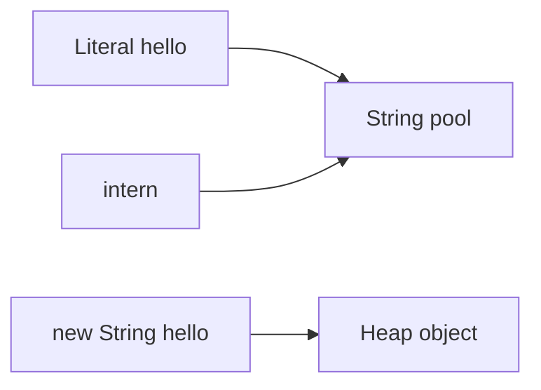

# Java Strings — deep notes (with examples)

**Browser:** [STRINGS.html](STRINGS.html) · Parent: [NOTES.md](NOTES.md) · Interview: [INTERVIEW-QA.md](INTERVIEW-QA.md)

**How to study:** for each section, read the “In simple words” paragraph, then type the example in a scratch `main` and compare the printed output.

---

## 1. What is a String?

### In simple words

A `String` is a piece of text. Once created, its characters **never change**.  
If a method looks like it “changes” the string, it actually **returns a brand-new string**.

```java
String s = "hi";
System.out.println(s.toUpperCase()); // HI  (new object printed)
System.out.println(s);               // hi  (original unchanged)

s = s.toUpperCase();                 // now s points to the new one
System.out.println(s);               // HI
```

### Why immutability matters (with a mental picture)

Imagine `String name = "Ada"` is a locked notebook. Nobody can erase a letter.  
If you need `"ADA"`, Java prints a **new** notebook and (if you assign) hands you that one.

| Benefit | Everyday meaning | Example |
| --- | --- | --- |
| Thread-safe | Many threads can read `"OK"` safely | Shared status messages |
| Safe as Map key | Key can’t mutate under the map | `map.put("userId", user)` |
| Pooling | Same literal can be shared | `"login"` reused |
| Security | Path/class name can’t be rewritten | File path strings |

---

## 2. Creating strings and the string pool

### In simple words

- Writing `"hello"` (a **literal**) often reuses one shared object from the **string pool**.
- `new String("hello")` **always** creates a new object on the heap (usually different address).

```java
String a = "hello";
String b = "hello";
String c = new String("hello");

System.out.println(a == b);          // true  — same pooled object (typical)
System.out.println(a == c);          // false — different objects
System.out.println(a.equals(c));     // true  — same characters

String d = c.intern();               // find/add in pool
System.out.println(a == d);          // true
```



### Rule you must remember

```java
String userInput = new String("admin"); // pretend this came from UI
if (userInput == "admin") { /* BAD — may be false */ }
if (userInput.equals("admin")) { /* GOOD */ }
if ("admin".equals(userInput)) { /* GOOD — also null-safe if userInput is null */ }
```

### `intern()` example (when it helps)

```java
String x = new String("repeat").intern();
String y = "repeat";
System.out.println(x == y);  // true — both point to pooled "repeat"
```

Use sparingly; don’t intern every random string in a huge log file.

---

## 3. `==` vs `equals` vs `compareTo`

### In simple words

| Check | Asks | Example result |
| --- | --- | --- |
| `==` | Same **object** in memory? | often false for equal text |
| `equals` | Same **characters**? | true if text matches |
| `compareTo` | Dictionary order? | 0 if equal, &lt;0 / &gt;0 if before/after |

```java
String x = "ab";
String y = new String("ab");

System.out.println(x == y);            // false
System.out.println(x.equals(y));       // true
System.out.println(x.compareTo(y));    // 0
System.out.println(x.compareTo("ac")); // negative (b < c)
System.out.println(x.compareTo("aa")); // positive
```

### Ignore case / null-safe

```java
System.out.println("Java".equalsIgnoreCase("java")); // true

String s = null;
System.out.println(java.util.Objects.equals(s, "a")); // false — no NPE
// s.equals("a");  // would NPE
```

---

## 4. StringBuilder and StringBuffer

### In simple words

`StringBuilder` is a **mutable** text buffer. You append into the same object, then call `toString()` once.

| | StringBuilder | StringBuffer |
| --- | --- | --- |
| Change in place? | Yes | Yes |
| Thread-safe? | No | Yes (synchronized) |
| Prefer | **Yes**, almost always | Only if shared across threads without other locks |

### Example — build a CSV line

```java
StringBuilder sb = new StringBuilder();
sb.append("Ada").append(',').append(30).append(',').append(true);
System.out.println(sb.toString());  // Ada,30,true

sb.setLength(0);                    // clear
sb.append("reset");
System.out.println(sb);             // reset
```

### Example — why `+=` in a loop is bad

```java
// Slow mental model: each step copies all characters so far
String s = "";
for (int i = 0; i < 5; i++) {
    s += i;   // "", "0", "01", "012", "0123", "01234"
}
System.out.println(s);  // 01234

// Fast: one buffer
StringBuilder fast = new StringBuilder();
for (int i = 0; i < 5; i++) {
    fast.append(i);
}
System.out.println(fast);  // 01234
```

For large `n`, the `+=` version is roughly **O(n²)** work.

### Example — reverse and insert

```java
StringBuilder sb = new StringBuilder("abc");
sb.reverse();
System.out.println(sb);           // cba
sb.insert(1, '-');
System.out.println(sb);           // c-ba
sb.deleteCharAt(1);
System.out.println(sb);           // cba
```

---

## 5. Important methods (each with an example)

Let `n` = this string’s length.

### length / isEmpty / isBlank

```java
String s = "  ";
System.out.println(s.length());    // 2
System.out.println(s.isEmpty());   // false
System.out.println(s.isBlank());   // true  (Java 11+) — only whitespace
```

### charAt / toCharArray

```java
String s = "cat";
System.out.println(s.charAt(1));   // a
char[] chars = s.toCharArray();    // {'c','a','t'}
for (char c : chars) {
    System.out.print(c + " ");
}
// c a t
```

### substring

```java
String s = "abcdef";
System.out.println(s.substring(2));    // cdef  (from index 2 to end)
System.out.println(s.substring(2, 5)); // cde   (from 2 inclusive to 5 exclusive)
// Modern Java copies characters into a new String (safe memory behavior).
```

### indexOf / lastIndexOf / contains / startsWith / endsWith

```java
String s = "banana";
System.out.println(s.indexOf('a'));        // 1
System.out.println(s.indexOf("an"));       // 1
System.out.println(s.lastIndexOf('a'));    // 5
System.out.println(s.contains("nan"));     // true
System.out.println(s.startsWith("ban"));   // true
System.out.println(s.endsWith("na"));      // true
System.out.println(s.indexOf("z"));        // -1  (not found)
```

### replace / replaceAll (careful: regex!)

```java
String s = "a.b.c";
System.out.println(s.replace('.', '-'));      // a-b-c  (literal char)
System.out.println(s.replaceAll("\\.", "-")); // a-b-c  (regex escaped)

// TRAP: "." means "any character" in regex
System.out.println("a.b".split("\\.").length); // 2
// "a.b".split(".")  → usually empty junk — wrong!
```

### split / join

```java
String line = "Ada,30,true";
String[] parts = line.split(",");
System.out.println(parts[0]);  // Ada
System.out.println(parts[1]);  // 30

String joined = String.join("-", "a", "b", "c");
System.out.println(joined);    // a-b-c

String messy = "one   two\t three";
String[] words = messy.trim().split("\\s+"); // one or more whitespace
System.out.println(words.length);            // 3
```

### trim vs strip

```java
String s = "  hi  ";
System.out.println("[" + s.trim() + "]");   // [hi]
System.out.println("[" + s.strip() + "]");  // [hi] — also handles more Unicode spaces (11+)
```

### toLowerCase / toUpperCase / repeat

```java
System.out.println("Java".toLowerCase()); // java
System.out.println("ha".repeat(3));       // hahaha  (Java 11+)
```

### format / valueOf

```java
String msg = String.format("User %s scored %d", "Ada", 95);
System.out.println(msg);                  // User Ada scored 95
System.out.println(String.valueOf(42));   // "42"
System.out.println(String.valueOf(null)); // "null" (the word) — careful!
```

---

## 6. Characters and encoding (short + example)

```java
String s = "A";
System.out.println((int) s.charAt(0));           // 65
byte[] utf8 = s.getBytes(java.nio.charset.StandardCharsets.UTF_8);
System.out.println(utf8.length);                 // 1

// Always pick a charset in real code — don’t rely on “platform default”
```

Emoji can need **two** `char`s (surrogate pair). For interviews with ASCII/letters, `charAt` is usually enough.

---

## 7. DSA patterns — full worked examples

### 7.1 Character frequency (a–z)

```java
static int[] freq26(String s) {
    int[] f = new int[26];
    for (int i = 0; i < s.length(); i++) {
        char c = s.charAt(i);
        if (c >= 'a' && c <= 'z') {
            f[c - 'a']++;
        }
    }
    return f;
}

// "aba" → a:2, b:1
int[] f = freq26("aba");
System.out.println(f[0] + " " + f[1]); // 2 1
```

### 7.2 Anagram check

```java
static boolean anagram(String a, String b) {
    if (a.length() != b.length()) return false;
    int[] f = new int[26];
    for (int i = 0; i < a.length(); i++) {
        f[a.charAt(i) - 'a']++;
        f[b.charAt(i) - 'a']--;
    }
    for (int n : f) if (n != 0) return false;
    return true;
}

System.out.println(anagram("listen", "silent")); // true
System.out.println(anagram("apple", "papel"));   // true
System.out.println(anagram("rat", "car"));       // false
```

### 7.3 Palindrome (two pointers, letters only)

```java
static boolean palindrome(String s) {
    int i = 0, j = s.length() - 1;
    while (i < j) {
        while (i < j && !Character.isLetterOrDigit(s.charAt(i))) i++;
        while (i < j && !Character.isLetterOrDigit(s.charAt(j))) j--;
        if (Character.toLowerCase(s.charAt(i)) != Character.toLowerCase(s.charAt(j))) {
            return false;
        }
        i++;
        j--;
    }
    return true;
}

System.out.println(palindrome("A man, a plan, a canal: Panama")); // true
System.out.println(palindrome("race a car"));                     // false
```

### 7.4 Reverse words in a sentence

```java
static String reverseWords(String s) {
    String[] parts = s.trim().split("\\s+");
    StringBuilder sb = new StringBuilder();
    for (int i = parts.length - 1; i >= 0; i--) {
        sb.append(parts[i]);
        if (i > 0) sb.append(' ');
    }
    return sb.toString();
}

System.out.println(reverseWords("  the sky   is blue ")); // blue is sky the
```

### 7.5 First non-repeating character

```java
static Character firstUnique(String s) {
    int[] f = new int[256];
    for (int i = 0; i < s.length(); i++) f[s.charAt(i)]++;
    for (int i = 0; i < s.length(); i++) {
        if (f[s.charAt(i)] == 1) return s.charAt(i);
    }
    return null;
}

System.out.println(firstUnique("leetcode")); // l
System.out.println(firstUnique("aabb"));     // null
```

---

## 8. Interview table (with one-line examples)

| Question | Short answer | Tiny code cue |
| --- | --- | --- |
| Mutable? | String no | `s.toUpperCase()` doesn’t change `s` |
| Builder when? | Loops / many appends | `sb.append(i)` |
| Pool? | Literals + intern | `"a" == "a"` often true |
| Content equal? | `equals` | never `==` for user text |
| Slow concat? | `+=` in loop | use Builder |

---

## 9. Performance tips (example)

```java
// Pre-size if you know length roughly
StringBuilder sb = new StringBuilder(1000);
for (int i = 0; i < 1000; i++) sb.append('x');

// Reuse Pattern if you split/match many times
java.util.regex.Pattern comma = java.util.regex.Pattern.compile(",");
String[] p = comma.split("a,b,c");
```

---

## 10. Checklist before an interview

- [ ] Explain immutability with the `"hi".toUpperCase()` example  
- [ ] Draw pool vs `new String`  
- [ ] Rewrite a `+=` loop with StringBuilder  
- [ ] Write anagram with `int[26]`  
- [ ] Explain `split("\\.")` vs `split(".")`  

Next: [COLLECTIONS.md](COLLECTIONS.md)
